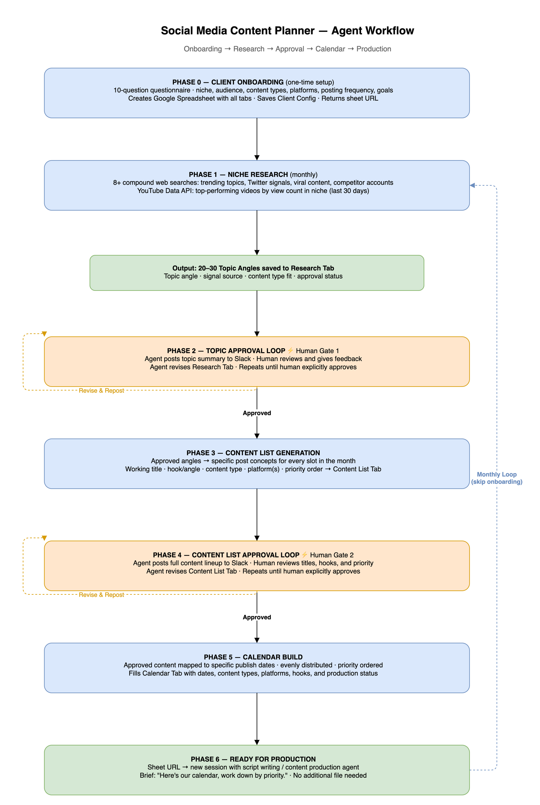

# Social Media Content Planner

A research-driven monthly content calendar skill for AI agents. Takes any client from zero to a fully researched, human-approved content calendar — ready for the production team to execute.

---

## What It Does

The agent runs a full content planning cycle:

1. **Onboards the client** — structured questionnaire captures brand, niche, audience, content types, frequency, and off-limits topics
2. **Builds a Google Spreadsheet** — one sheet per client with dedicated tabs for research, content list, and calendar
3. **Researches trending topics** — compound web search battery + YouTube Data API to find what's actually performing in the niche right now
4. **Runs human approval loops** — posts summaries to Slack (or in-conversation), iterates based on feedback, gets explicit sign-off before moving forward
5. **Generates a dated calendar** — maps every approved piece of content to a specific publish date, spread evenly across the month
6. **Hands off to production** — the spreadsheet is the handoff artifact; no extra files needed

On the monthly loop, it re-runs research and generates a new month without re-onboarding. The spreadsheet accumulates a full history.

---

## How It Works

| Phase | What Happens |
|---|---|
| Phase 0 | Client onboarding questionnaire → spreadsheet created |
| Phase 1 | Web search battery + YouTube Data API → topic bank |
| Phase 2 | Topic approval loop (human reviews, agent iterates) |
| Phase 3 | Content list generated from approved topics |
| Phase 4 | Content list approval loop |
| Phase 5 | Dated calendar built in the spreadsheet |
| Phase 6 | Handoff to production team |
| Phase 7 | Monthly loop — re-run for next month, same client |

---

## Template Spreadsheet

Start with a pre-built copy of the spreadsheet structure — all 4 tabs created and formatted, ready for the agent to populate.

👉 **[Copy the Template](https://docs.google.com/spreadsheets/d/1rFjKSavmf3qIjauROP2wEic7HMD9yPALLT9vYMDpRK4/copy)**

Tabs included:
- `Client Config` — brand/client settings
- `Research [Month YYYY]` — topic bank
- `Content List [Month YYYY]` — post titles, hooks, types
- `Calendar [Month YYYY]` — dated production calendar

The agent will populate all tabs as it runs through the phases. You can also let the agent create a fresh sheet from scratch during onboarding — the template is optional but saves a step.

---

## Prerequisites

### Google Sheets Access

The agent writes and formats the spreadsheet via Google Sheets API v4. Set up one of:

- **Service account** — create in Google Cloud Console, share the sheet with the service account email
- **API key** — simple setup but limited to public sheets; not recommended for client data
- **Maton connection** — if you're running this on OpenClaw/Maton infrastructure, use your Google Sheets connection ID

### YouTube Data API (Recommended)

Significantly improves research quality by pulling real view-count-ranked videos from the past 30 days.

1. Go to [Google Cloud Console](https://console.cloud.google.com)
2. Enable **YouTube Data API v3**
3. Create credentials → API Key
4. Set as `YOUTUBE_DATA_API_KEY` in your environment

Free tier: 10,000 units/day. A typical research run uses ~100–300 units. The skill falls back to web search only if no key is present.

### Communication Surface

The approval loops post summaries for human review. Defaults to in-conversation. For team workflows, pipe to a Slack channel.

---

## Quickstart

Install the skill, then trigger it:

> "Run the social content planner for [Brand Name]. Start with onboarding."

Or for an existing client with a spreadsheet already built:

> "Run the monthly content planning loop for [Brand Name]. Sheet: [URL]"

---

## Spreadsheet Structure

Each client gets one Google Spreadsheet. Tabs added per planning cycle:

| Tab | Created When | Purpose |
|---|---|---|
| `Client Config` | Onboarding | All brand/client settings — never deleted |
| `Research [Month YYYY]` | Monthly | Topic bank with approval status |
| `Content List [Month YYYY]` | After topic approval | Specific post titles, hooks, content types |
| `Calendar [Month YYYY]` | After list approval | Dated calendar with production status |

---

## Content List Columns

| Column | Description |
|---|---|
| # | Slot number |
| Working Title | Specific, compelling title |
| Hook / Angle | One sentence — the frame that makes it worth watching |
| Content Type | Short video / Long video / Article / Image |
| Platform(s) | TikTok, IG, YouTube, Facebook, LinkedIn, etc. |
| Priority | Suggested publish order |
| Publish Date | Assigned in Phase 5 |
| Script Notes | Production notes for the team |

---

## Notes

- The skill is fully client-agnostic — works for any brand in any niche
- Approval gates ensure the human is always in control before the calendar is locked
- The Google Spreadsheet is intentionally the single source of truth — no handoff files, no separate docs
- For public/standalone deployments without Slack, all approval loops run in-conversation
